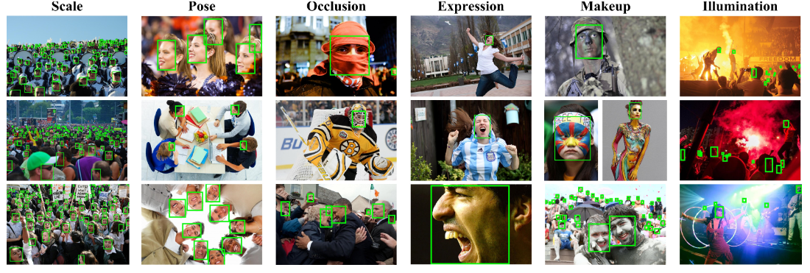
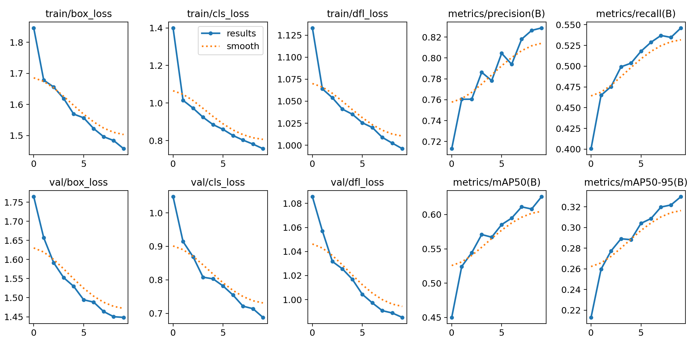

# [Yolov8](https://github.com/ultralytics/ultralytics) face detection with [Wider face](http://shuoyang1213.me/WIDERFACE/index.html)

This repository provides an implementation of YOLOv8 (You Only Look Once) face detection using the WIDER Face dataset. YOLOv8 is an improved version of the YOLO algorithm that achieves higher accuracy and improved performance.

The [Wider face](http://shuoyang1213.me/WIDERFACE/index.html) dataset is a widely-used benchmark dataset for face detection tasks, containing images with various face sizes, poses, and occlusions. This implementation utilizes the WIDER Face dataset to train and evaluate the YOLOv8 model specifically for face detection.

### Dataset

We use [WiderFace dataset](http://shuoyang1213.me/WIDERFACE/) for face detection<br>



First, prepare dataset for training. Training folder should look like this:

```
--- dataset folder
|    |--- train
|    |    |--- images
|    |    |--- labels
|    |--- valid
|    |    |--- images
|    |    |--- labels
```

# Getting Started

## Prerequisites

To run this project, you need to have the following dependencies installed:

- Python (3.6 or higher)

- PyTorch (1.7.0 or higher)

- OpenCV (4.2.0 or higher)

- Numpy (1.18.0 or higher)

- Matplotlib (3.2.0 or higher)

- CUDA Toolkit (optional, for GPU acceleration)

# Installation
Clone the repository:
``` bash
git clone https://github.com/yahyoxonqwe/yolo_face_detection.git
```
Change into the project directory:
``` bash
cd yolo_face_detection
```
Install the required dependencies:
``` bash
pip install requirement.txt
```
## Deploy model

- Run Deploy train.ipynb<br>


